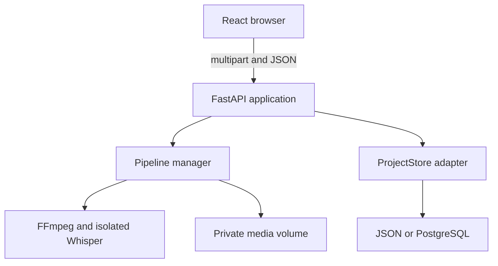
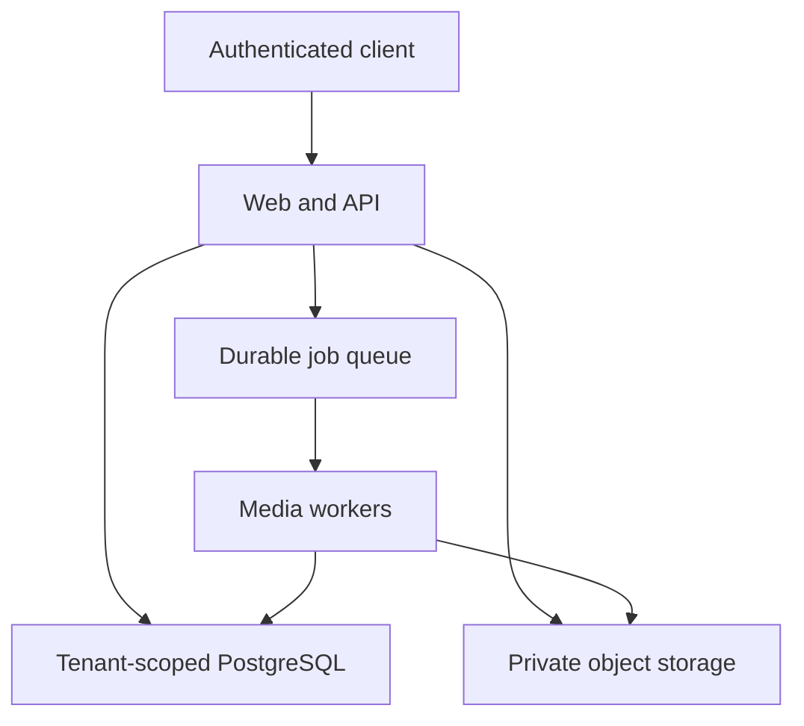

# System Architecture

## Implemented private MVP

The Docker image packages the built browser client and FastAPI into one service. FastAPI serves both the API and production web assets. Vite is a separate development server only.

## Component responsibilities

### React client

- Upload form and transfer progress
- Project list and polling
- Processing/failed/ready states
- Source-video preview
- Candidate explanation and confidence display
- Title, range and caption editor
- Render and download controls
- Explicit delete confirmation

### FastAPI

- Request validation and safe response models
- Multipart stream-to-disk upload
- Project/candidate commands
- OpenAPI contract
- Static web serving in production image
- Persistence and pipeline composition

### Pipeline manager

- Task deduplication and bounded concurrency
- Startup recovery
- Inspection, transcription, candidate generation and render stages
- Safe failure states
- Project-directory cleanup

### Media functions

- FFprobe metadata validation
- Faster Whisper local transcription
- Transcript/timeline candidate generation
- SRT cue generation
- Vertical FFmpeg render

### ProjectStore

- Atomic JSON adapter for database-free use
- Asyncpg/PostgreSQL adapter when `DATABASE_URL` is present
- Identical Pydantic project document at the API boundary

## Data locations

| Data | JSON mode | PostgreSQL mode |
|---|---|---|
| Project state | `data/state/projects.json` | `clipmine.projects.payload` |
| Source video | Private data volume | Private data volume |
| Rendered clips | Private data volume | Private data volume |
| Whisper model cache | Runtime user cache | Runtime user cache |

Connecting PostgreSQL does not move media into the database.

## Current trust boundary

The whole application is one private trust zone. There is no user identity boundary yet. A random person who can reach the HTTP service can access its projects, media and delete commands. Network access must therefore be restricted to the trusted operator.

Within that boundary:

- Client filenames never determine server directories.
- IDs are generated server-side.
- Source extensions and FFprobe content are validated.
- Candidate IDs must belong to the requested project.
- Project deletion removes its generated directory.
- Real `.env`, media, state and outputs are Git-ignored.
- PostgreSQL objects live in a private schema used only by FastAPI.

## Public-beta target architecture

The target retains the current logical commands but changes infrastructure boundaries:

- Browser uploads directly to private object storage through short-lived instructions.
- API owns identity, workspace permissions, commands and state.
- Queue carries opaque stage/project IDs, never raw media or credentials.
- Workers receive least-privilege asset access and persist idempotent stage results.
- PostgreSQL queries are workspace-scoped.
- Media downloads use authenticated, short-lived URLs.

## Migration order

1. Add authentication and workspace ownership to the API/data model.
2. Add object-store adapter and copy/delete reconciliation.
3. Persist explicit job/stage records.
4. Move the pipeline executor into a worker without changing stage functions.
5. Add rate limits, usage reservations and retention jobs.
6. Introduce provider adapters only after quality/cost benchmarks.

The current single-service build remains the reproducible behaviour reference during that migration.
