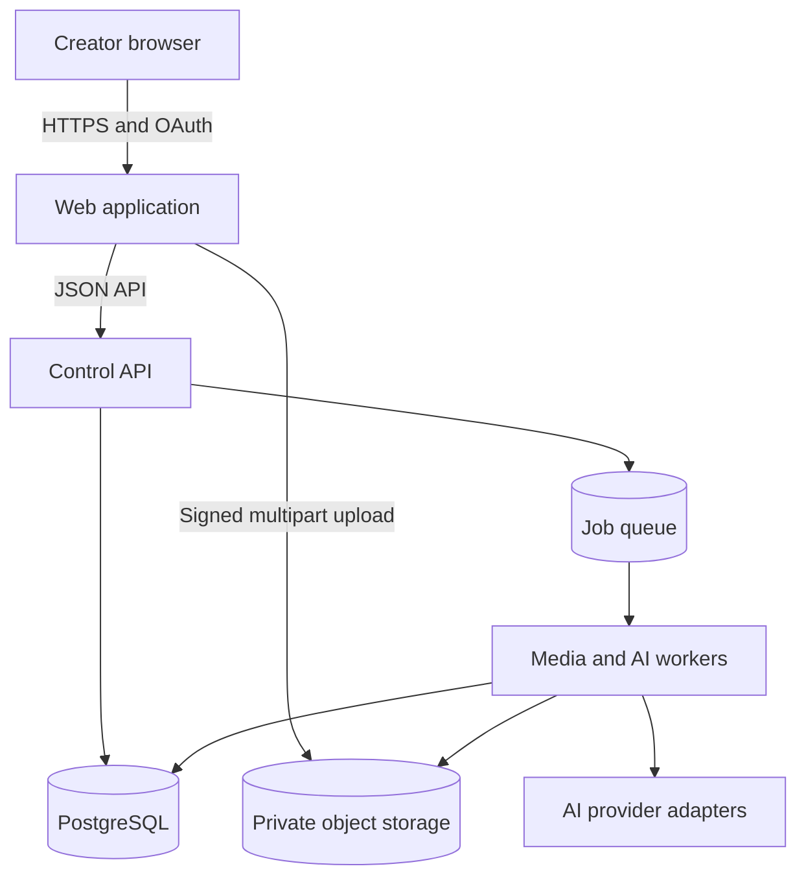
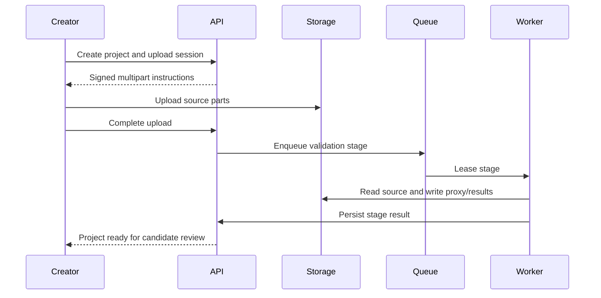

# System Architecture

## Context

ClipMine separates the control plane from expensive media work. The browser handles direct media transfer; the API manages permissions and state; workers perform analysis and rendering; private object storage holds source and derived assets.

## Trust boundaries

1. **Public client boundary:** browser data is untrusted; validate again on the server.
2. **Tenant boundary:** workspace identity scopes all projects, records and assets.
3. **Worker boundary:** workers receive least-privilege, time-limited access.
4. **Provider boundary:** only required media/text is shared under configured provider terms.
5. **Publishing boundary:** social credentials and submission state are isolated from editing.

## Core components

### Web application

- Authentication UX
- Project/upload management
- Candidate review and editor
- Status updates via polling first; server events/websocket only when justified
- Direct signed upload/download

### Control API

- Authorisation and workspace scoping
- Upload-session orchestration
- Project and clip commands
- Job state and idempotency
- Usage reservations
- Signed URL issuance
- Later OAuth and publishing commands

### PostgreSQL

System of record for user-visible state. Large binary media never lives in the database.

### Queue

Carries stage IDs rather than raw media. Supports visibility/lease, delayed retry, priority and dead-letter handling.

### Media workers

- Probe and normalise media
- Build analysis proxies
- Extract audio
- Call transcription/analysis adapters
- Detect scenes/faces/speakers as configured
- Render previews and final outputs

### Object storage

Separate prefixes/buckets for source, proxy, preview and export. All private. Lifecycle policies enforce retention and abandoned-upload cleanup.

## Project processing sequence

## Availability strategy

- API replicas are stateless.
- Jobs are restartable and inputs immutable/versioned.
- Upload parts and job outputs are reconciled by scheduled maintenance tasks.
- Provider outages enter retry/backoff without blocking the application.
- The UI reads persisted state rather than relying on an open connection.

## Scaling path

Prototype: one API, one worker and managed Postgres/storage.  
MVP: separate CPU worker pool, concurrency limits and autoscaling from queue depth.  
Later: GPU or specialised analysis pool only if benchmarks justify it; region-aware media processing and storage policies.

## Architecture invariants

- No public source-media URLs.
- No long media operation inside an interactive request.
- No unscoped project or asset query.
- No publisher call without explicit user confirmation.
- No job result without provider/pipeline version provenance.

