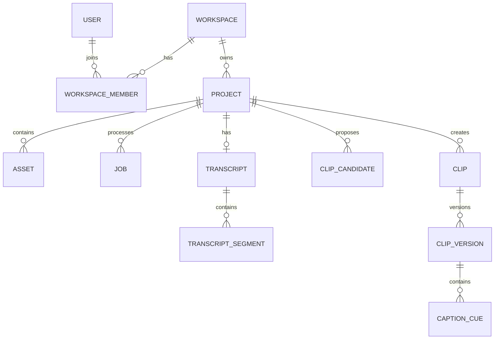

# Data Model

This is the logical model. Physical columns, types and indexes will be finalised through migrations and measured query patterns.

## Main entities

| Entity | Purpose | Important fields |
|---|---|---|
| `users` | Application identity profile | `id`, auth subject, locale, status, timestamps |
| `workspaces` | Tenant and ownership boundary | `id`, name, plan, status |
| `workspace_members` | User-to-workspace roles | workspace, user, role |
| `projects` | One source-video workflow | workspace, title, status, language, settings, source duration |
| `assets` | Private source/derived media metadata | workspace, project, kind, object key, bytes, checksum, media metadata, retention state |
| `upload_sessions` | Multipart upload recovery | project, provider upload ID, expected bytes, expiry, status |
| `jobs` | Background processing stage | project, type, state, input version, attempts, lease, error code, usage |
| `transcripts` | Transcript-level provenance | project, language, provider, model, version, confidence |
| `transcript_segments` | Timestamped words/speaker turns | transcript, start/end, text, speaker, confidence |
| `analysis_features` | Versioned scene/audio/visual signals | project, feature type, time range, payload/version |
| `clip_candidates` | Proposed time ranges and ranking | project, start/end, score band, reason payload, pipeline version, status |
| `clips` | Creator-selected logical clip | project, source candidate, title, state |
| `clip_versions` | Immutable edit/render instructions | clip, version, boundaries, crop, captions, style, render status |
| `caption_cues` | User-editable caption groups | clip version, start/end, text, styling overrides |
| `brand_kits` | Workspace styling defaults | fonts, colours, logo asset, caption theme |
| `social_accounts` | Later encrypted OAuth connection metadata | workspace, platform, external account, token reference, scopes, status |
| `publications` | Later user-approved publishing attempt | clip version, destination, metadata, status, external ID, idempotency key |
| `usage_events` | Metering and cost provenance | workspace, project/job, unit, quantity, provider cost reference |
| `audit_events` | Security/administrative history | actor, workspace, action, target, reason, timestamp |
| `deletion_requests` | End-to-end deletion tracking | scope, requested by, state, completed timestamp |

## Ownership relationships

## Project states

- `draft`
- `uploading`
- `uploaded`
- `processing`
- `ready`
- `partially_failed`
- `failed`
- `deleting`
- `deleted`

Project state is derived from authoritative upload/job state where possible. Avoid multiple independent flags that can contradict each other.

## Candidate states

- `suggested`
- `accepted`
- `rejected`
- `converted_to_clip`

Keep rejected candidates for short feedback/calibration retention only if the privacy policy permits it; otherwise aggregate or delete them with the project.

## Asset kinds

- `source`
- `analysis_proxy`
- `audio_extract`
- `candidate_preview`
- `final_export`
- `caption_sidecar`
- `brand_asset`

## Data integrity rules

- Every tenant-owned row carries `workspace_id` directly or through a protected parent.
- One active source asset per project input version.
- Clip version numbers unique per clip.
- Job idempotency key unique per stage/input/pipeline version.
- Asset object keys unique and never accepted directly from clients.
- Publication idempotency unique per user-confirmed destination attempt.
- Deletion states prevent new job creation.

## Index baseline

- Project list: `(workspace_id, created_at desc)` and status
- Job pickup/recovery: `(state, available_at, priority)` and lease expiry
- Candidate ranking: `(project_id, rank)`
- Clip/version lookup: project/clip foreign keys
- Usage reporting: `(workspace_id, occurred_at)`
- Audit lookup: target and occurred time

## Retention

Retention periods are configuration and policy, not buried database defaults. Deleting a project must cover assets, transcript text, derived features, provider files where applicable and caches. Minimal audit/billing records must not retain the media or transcript itself.

